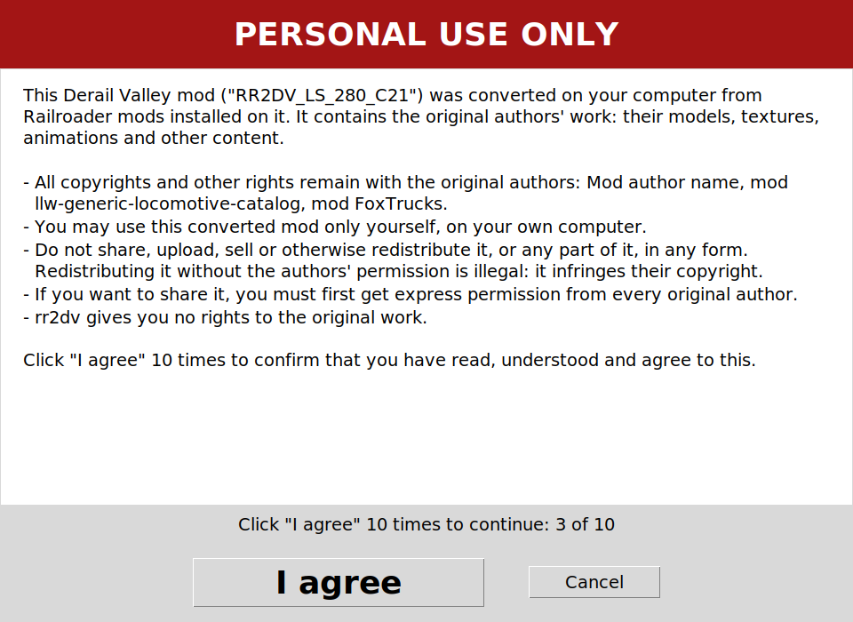
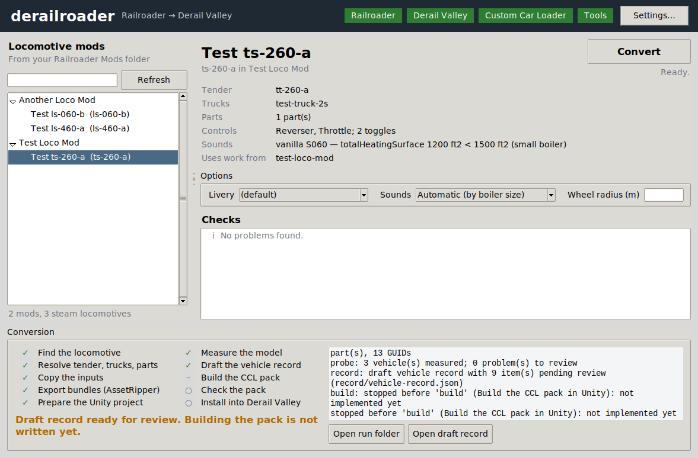

# derailroader

A local interoperability tool which converts supported locomotive assets already installed in the user's Railroader
Mods directory into a structure usable by Derail Valley.

The tool is called `rr2dv` on the command line. It takes a steam locomotive mod from your own Railroader `Mods`
folder, rebuilds it for the Derail Valley Custom Car Loader (CCL 3.1.9), and installs the result into your own Derail
Valley `Mods` folder. It never changes the Railroader mod it reads.

Version 0.1.2 addresses the first C-70 gameplay report: populated steam HUD,
explicit control highlights, source-derived ancillary interactions and clearer fixed-gearing information.
See [the follow-up and validation notes](docs/c70-first-gameplay.md). Gameplay acceptance is still pending.

> **Work in progress: first end-to-end version.** Every stage is written, from finding the mod to installing the pack.
> Windows/Unity 2019.4 testing now reaches export and bundle audit for S16, C21 and A18; A18 also completed
> installation through the normal notice. Remaining visual/control warnings are recorded in X46. An installed pack is a **candidate**: it
> still has to be checked in Derail Valley (see *What a finished pack must pass*).

The X43 development fixes check prefab save/reload success, report removed missing-script components, select the
main driving-wheel candidate for review, and support untinted renderer materials when no named tint map exists.
Blocked runs retain their automatic choices in `build/review.json`. See [resolving blocks](docs/resolving-blocks.md)
for the remaining material and control-mapping limits. Real locomotive and runtime acceptance are separate gates.

## Personal use only

A converted pack contains third-party work. Before anything is written to your Derail Valley `Mods` folder, `rr2dv`
shows a large notice. It says that copyright in the source assets stays with their rights holders, that rr2dv grants
no permission to redistribute, and that you should not share the conversion unless the applicable licences already
permit it or you have any required permission from the relevant rights holders. It also lists the source content it
detected. You click **I agree** ten times to continue, and there is no setting that skips it.

The installed pack carries `NOTICE.txt` (the same text), `SOURCE_PROVENANCE.txt` (notice version, when it was
acknowledged, which mods and authors the content came from) and an `rr2dv.json` record of the same.



## Installation

These steps are for Windows. Install Railroader and Derail Valley through Steam first, or set their install folders in
**Settings…**. The portable app includes Python and Tk; the source download needs Python 3.11 or later with Tk.
Use the linked publisher or project pages below for downloads, and check the version and file name before opening an
archive. Avoid third-party download mirrors.

### Set up Derail Valley mods

1. Download [Unity Mod Manager from its Nexus Mods page](https://www.nexusmods.com/site/mods/21). Extract its archive,
   run UnityModManager, select **Derail Valley**, and install it using **Doorstop Proxy** as directed on that page.
2. Download **Custom Car Loader v3.1.9** from the **Main files** on the
   [CCL Nexus Mods page](https://www.nexusmods.com/derailvalley/mods/324?tab=files). Also install the dependencies
   listed on that page, including Language Helper. In Unity Mod Manager's **Mods** tab, add the CCL mod archive
   without extracting it. Confirm CCL shows **OK**. This is the game mod, separate from the Car Creator Package below.

### Install the three build tools

1. **Unity Editor 2019.4.40f1:** Get this exact version from
   [Unity's 2019.4.40f1 release page](https://unity.com/releases/editor/whats-new/2019.4.40f1) and install the Windows
   Editor, using Unity Hub or Unity's installer. In the app's **Settings…**, `unity` must point to that installation's
   `Editor\Unity.exe` (for example, `C:\Program Files\Unity\Hub\Editor\2019.4.40f1\Editor\Unity.exe`). A newer Unity
   version is not a substitute.
2. **CCL Car Creator Package v3.1.9:** On the same
   [CCL Nexus Mods page](https://www.nexusmods.com/derailvalley/mods/324?tab=files), download **Car Creator Package**
   from **Optional files**, making sure it says v3.1.9. Unzip the downloaded archive into a folder you choose,
   preferably under **Documents** or on your **Desktop**. Keep the extracted
   `CarCreator_3.1.9.unitypackage` there; in **Settings…**, set `carCreator` to that file, not to the downloaded ZIP or
   its containing folder. The app imports the package when it builds a conversion, so you do not need to open it in
   Unity yourself.
3. **AssetRipper:** Get the stable **Windows x64** release from the
   [AssetRipper project's downloads page](https://assetripper.github.io/AssetRipper/articles/Downloads.html). Extract
   the whole archive into a folder you choose and keep its files together. In **Settings…**, set `assetRipper` to the
   extracted `AssetRipper.GUI.Free.exe` (or the `AssetRipper.GUI.exe` supplied by your release), not to the ZIP.

### Install and check Derailroader

For the [0.1.2 release](https://github.com/james-taplin/derailroader/releases/tag/v0.1.2), download
`Derailroader-0.1.2-Windows.zip`, extract the **whole** folder, and double-click `Derailroader.exe`. Keep its
`_internal` folder beside the `.exe`. To run from scripts instead, download `Derailroader-0.1.2-Source.zip`, extract
it, and double-click `Launch Derailroader.bat` (or `Derailroader.pyw` if Python is associated with `.pyw` files).
The source download needs Python 3.11+ with Tk; neither download includes Unity, AssetRipper or CarCreator.

In the app, choose **Settings… → Check**, then **Save** the detected tool paths. If a tool is not found, browse to the
exact file described above and check again. The command-line equivalent is `rr2dv doctor`.

## Using the app

Developers can also run from a checkout:

```
python -m pip install -e .        # run from this repository: rr2dv uses its tooling/ folder
derailroader                      # opens the app (or: rr2dv gui)
```



- The coloured chips at the top show whether Railroader, Derail Valley, Custom Car Loader and the tools were found
  (hover for where). In **Settings…**, **Check** searches common tool locations, fills missing paths and checks the
  values shown. Click **Save** to use newly found paths. The Windows `.exe` includes the Python needed by the builder.
- The left side lists the steam locomotive mods in your Railroader `Mods` folder; type to filter.
- Pick a locomotive to see its tender, trucks, parts, controls, sounds, whose work it uses and any problems. Choose
  the livery and sounds, then **Convert**. The stages tick off below as they run; afterwards you can open the run
  report folder, the vehicle record and the finished pack folder.
- After measurement, **Pre-build review** asks for the train-brake valve type, spawning mode, physical driving-wheel
  **radius**, cylinder count and steam profile. The source evidence tab shows measured wheel candidates. Choices
  are saved in `prebuild-review.json`; load that file on a rerun. A changed source or adapter rejects stale answers.
- Normal spawning can be radio only, a manually selected suitable track pool, or all suitable tracks. Track filtering
  uses the whole locomotive/tender length, coupling allowance and clearance; reserved stock tracks are excluded.
- Simple and fixed-geared steam profiles are experimental. Compound switching, oil-regime combinations, articulated
  calibration and diesel adapters remain pending. See [implementation status and tests](docs/review-and-geometry.md).
- End beams below the usual coupler-height band are measured automatically when that band is inconclusive.
  The search allows a central drawgear opening and distinguishes the outer beam from truck crossmembers behind it.
  A reviewed geometry override is needed only when automatic measurement remains inconclusive.
- The personal-use notice opens inside the app before anything is installed.

## Command line

```
rr2dv doctor                      # finds both games and checks Unity, CarCreator, AssetRipper and CCL
rr2dv list                        # steam locomotive mods in your Railroader Mods folder
rr2dv scan "Some Loco Mod"        # read-only: what the mod contains and what each loco needs
rr2dv convert "Some Loco Mod"     # interactive pre-build review
rr2dv convert "Some Loco Mod" --review-file prebuild-review.json  # replay reviewed choices
```

You name a mod by its folder in the Railroader `Mods` folder, or give that folder's path. Zip files and folders
elsewhere are refused.

`convert` options:

| Option | Meaning |
|---|---|
| `--loco ID` | which locomotive, when the mod has more than one |
| `--livery NAME` | livery to use (default: the mod's first) |
| `--audio S060\|S282` | vanilla sound set instead of the boiler-size rule |
| `--wheel-radius M` | the driving wheel tread radius, once you have reviewed the measured candidate (the first run stops and prints the command with it) |
| `--search DIR` | an extra folder to look in for dependencies |

## What happens

Each conversion gets a fresh run folder under the work folder. The pipeline runs these stages and stops at the first
one that fails or is not built yet:

| Stage | What it does | State |
|---|---|---|
| locate | find the locomotive in the mod | working |
| link | resolve its tender, trucks and parts, including those from other installed mods and Railroader's own asset packs | working |
| stage | copy the needed files into the run folder, hash-checked | working |
| extract | export the bundles with AssetRipper into temporary storage | working |
| import | assemble a Unity 2019.4 project: restored animation paths, dependencies, CarCreator, our builder | working |
| probe | measure the model in Unity: hierarchy, anchors, animations, wheel tread candidates | working |
| record | draft the vehicle record: every value with its unit, basis and evidence; unknowns listed for review | working |
| build | complete the record from the measurements (running gear, cab, controls, anchors, collision; every automatic choice listed for review), then build the CCL pack in Unity with our builder | new |
| audit | read the exported pack with Unity's own loader: no audio, Custom Car Loader scripts only, the controls the HUD needs, the recorded mass and wheel radius | new |
| publish | show the notice, then install into Derail Valley's `Mods` folder | new |

Both game installs are found before a conversion starts, again before the Unity build, and again just before
installing.

## If a conversion stops

It stops rather than guess, and always says why: in the app's Checks list and Conversion panel, in the command
line's output, and in the run folder. **[docs/resolving-blocks.md](docs/resolving-blocks.md) lists every block and
review item and how to resolve each one.** The tool cannot yet ask you questions mid-run or resume a stopped run:
give your answers when you start (the app's Options, or `--loco`, `--livery`, `--audio`, `--wheel-radius`) and
convert again after fixing a block. Reruns are safe and start from the source files again.

For diagnosis, every run writes a readable **`run.log`** in its run folder (settings and installs used, every stage,
every issue, what AssetRipper and Unity reported, review items, and the full traceback of any unexpected error), and
the app and command line keep **`%LOCALAPPDATA%\rr2dv\logs\rr2dv.log`** for everything outside a run.

### Temporary storage and rebuild reports

By default, copied inputs, ripped assets, Unity projects (including Library), renders and build intermediates
are permanently deleted when a conversion ends, including failures and stops for an answer. Deletion does not use
the Recycle Bin. The app waits until its tools finish and preserves the final output before deleting intermediates.
Installed packs stay in DV Mods without a duplicate. An audited pack that was not installed is hash-verified into
`<workRoot>/output/<run-id>/<pack-name>` first. **Open build folder** opens this finished output or the installed pack.

Small reports remain in `<workRoot>/reports/<run-id>`: status, recorded choices, vehicle record, audit and bounded
diagnostic log tails (at most 2 MiB per copied log). **Open run folder** opens the report. `rebuild.json` records
source-file hashes, app/source and snapshot hashes, tool executable/package fingerprints, runtime versions,
reviewed answers and expected output hashes. Its recipe SHA-256 identifies the recorded recipe; it is not a random
seed. Rebuilding requires the original sources and matching tools. Byte-identical Unity bundles are **not verified**;
tool dependencies and Unity build metadata can affect output. No ripped assets are kept in the report.

Locked/failed deletions are reported and retried before the next conversion. Live conversions, linked paths and
Unity-locked projects are not deleted. Recovery applies only to marked temporary folders created by this version;
older runs and shared caches are not swept automatically. Installed editors/rippers are shared tools and stay installed.
For deliberate developer diagnosis only, JSON setting `"keepWorkFiles": true` retains the old workspaces and caches;
the normal default is false. Retention makes reruns faster but increases disk usage.

## Rules the tool follows

- **Sounds are never converted.** Every loco uses vanilla Derail Valley sounds: S060 for a small boiler (under
  1,500 ft² heating surface), S282 otherwise. `--audio` overrides this.
- **Dependencies:** everything a loco uses from your own Railroader install is used, whichever mod it comes from.
  A part the source mod references but does not contain is left out and listed, because Railroader cannot load it
  either.
- **Nothing is guessed.** Values that need measuring or a person's review stay empty and are listed in the draft
  record's `metadata.pending`. Two equally good matches are an error, never a first pick.
- **Deterministic:** the same input files, answers and tool versions give the same result. Your answers are saved
  in the run record, so a rerun needs no input.
- **Where it writes:** the run folder, and your Derail Valley `Mods` folder after you agree to the notice. It never
  writes to the Railroader install or touches saves. It replaces a folder in Derail Valley's `Mods` folder only if
  `rr2dv` made that folder earlier; any other mod's folder is left alone.

## What a finished pack must pass

The build uses our builder's own gates (`tooling/`, guide rules Q02–Q05), and the audit checks the exported pack before
anything is installed. A pack that builds and passes the audit is still only a **candidate**: the control gates below
(board X42, which keeps CTRL-01, CTRL-02 and BR-01) are checked in game, and anything not yet checked stays pending.
Earlier accepted conversions (G-29, C-21) are evidence of what works, not templates every locomotive must copy.

1. **Proven fixes are kept.** Behaviour fixed on earlier conversions is not reintroduced; geometry, travel and tuning
   are worked out for this locomotive, never copied as a universal preset.
2. **Every control is there and does its job.** Throttle, reverser, brakes, whistle, injector, blower, damper, fire
   door and the rest each drive their own function; anything missing or replaced is listed, never silently lost.
3. **Right pivot, axis, direction and travel**, with the handle, joint and reported value agreeing at both ends.
4. **Grips you can reach**, each collider belonging to its own control and covering the grip, not the whole arm.
5. **No interference through full travel** between controls or with the cab; contacts investigated, not whitelisted.
6. **Fine, prompt response (CTRL-01)**: small inputs move and report; the full range is reachable without sticking,
   lag or overshoot.
7. **Holding, return and detents**: set controls stay set, momentary ones (the whistle) return, intended steps remain.
8. **Closed means exactly zero (CTRL-02)**: a closed throttle, whistle or other steam valve gives no steam flow at all
   under pressure, not just 0% on the HUD.
9. **Every input route agrees**: grabbing, the HUD, keyboard/scroll (and VR where used) move the same control the same
   way, and the gauges and labels tell the truth.
10. **Repeated use and save/reload**: tiny openings, full travel, repeated use, and the state after saving and loading.
11. **External fittings placed right**: the brake release stands upright with its red handle pointing outward and its
    hanger up into the mounting (BR-01), the handbrake wheel faces out, grips are clear.
12. **Evidence before acceptance**: what was checked is recorded per control and input route; untested means pending.

What the app does about them today: it lists every automatic choice in `build/review.json` (for example: Railroader's
cab handles become Derail Valley levers with starting joint settings taken from the accepted G-29 build per kind of
control; functions Railroader has no handle for get generated controls on the backhead); the builder reports control
sweeps and fitting checks in `build/out/build_report.txt` with renders beside it; and the audit refuses a pack with
audio in it, scripts other than Custom Car Loader's, a HUD control or driving control without its feeder, or a brake
release that is not upright with its handle outward. The in-game checks are yours.

## Settings

If a measured beam sits outside the builder's default sampling band, an explicit **Reviewed geometry** JSON file
can supply that car's sampling heights (CLI: `--geometry-review FILE`). It must match the source fingerprint and
include measurement evidence; see [reviewed end-beam geometry](docs/resolving-blocks.md#reviewed-end-beam-geometry).
The builder's ray-count and clearance checks stay active.

Settings live in `%APPDATA%\rr2dv\machine.json` (or pass `--machine FILE`). The app's **Settings…** dialog edits the same
file. All keys are optional except the tools:

| Key | What |
|---|---|
| `unity` | `Unity.exe` of Unity 2019.4.40f1 |
| `carCreator` | `CarCreator_3.1.9.unitypackage` |
| `assetRipper` | the AssetRipper executable |
| `python` | Python for the builder's own scripts |
| `railroader` | Railroader install folder (default: found through Steam) |
| `game`, `mods` | Derail Valley install and `Mods` folder (default: found through Steam) |
| `steamRoots` | Steam folders to search instead of the registry and default locations |
| `workRoot` | where run folders go; at most 74 characters, e.g. `C:\rr2dv` (Unity 2019.4 needs short paths) |
| `searchRoots` | extra folders to look in for dependencies |

## Repository

| Path | What |
|---|---|
| [`src/rr2dv/`](src/rr2dv/) | the app: Python standard library only (the window uses Tk, included with Python on Windows), plus a Unity editor probe in [`src/rr2dv/unity/`](src/rr2dv/unity/) |
| [`tests/`](tests/) | automated tests on made-up mods, with stand-ins for AssetRipper and Unity |
| [`tooling/`](tooling/) | read-only snapshot of our conversion tooling and guides, used as the reference implementation (start with [`tooling/NOTES.md`](tooling/NOTES.md)) |
| [`board/APP_BOARD.md`](board/APP_BOARD.md) | message board between this app's Claude session and the local Claude and Codex sessions |
| [`docs/`](docs/) | [resolving blocks](docs/resolving-blocks.md), design notes ([replacing dependencies with vanilla DV content](docs/later-dependency-replacement.md), parked) and the screenshots on this page |
| [`CLAUDE.md`](CLAUDE.md) | notes for Claude sessions working on the app |

Run the tests with `PYTHONPATH=src:tests python -m unittest discover -s tests` (on Windows use `src;tests`). The
window tests run where Tk and a display are available (Windows, or Linux under Xvfb) and are skipped otherwise.
For the real prefab-save regression, set `RR2DV_TEST_UNITY` to the Unity 2019.4.40f1 executable and run
`python -m unittest discover -s tests -p test_unity_runtime.py -v` with the same `PYTHONPATH`. It creates a temporary
synthetic project, verifies an actual missing-script save failure, recovery and preservation of valid components,
and checks that preparation failure never reaches the builder. It uses the normal hidden-window launcher because
the local Personal licence does not support batch mode. No game assets or install notice are involved.

## Licence

The code in this repository is released under the Unlicense (see [`LICENSE`](LICENSE)). It covers this tool only,
not the content it converts: copyright and other rights in the source assets remain with their respective rights
holders.
